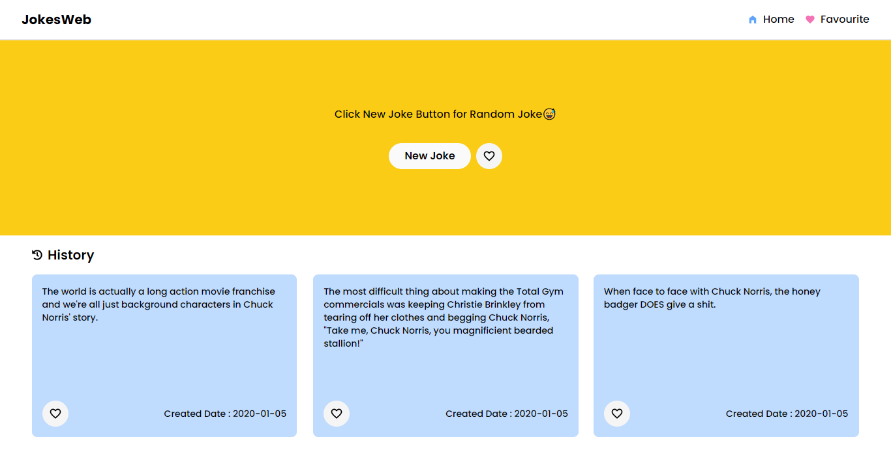

## Random Jokes Ineuron Internship Project

---

This is a simple random jokes appthat displays a random joke everytime user clicks on fetch a new joke button.

</br>

### 🔗 Demo : [Link](https://random-jokes-ineuron-internship-sm8ut.netlify.app/)

</br>

### 🖥️ ScreenShot :

</br>



</br>

### 👩‍💻 Tech Stack :

</br>

- React Js
- Tailwind CSS

</br>

#### Dependencies :

</br>

```javascript

  "dependencies": {
    "axios": "^1.4.0",
    "framer-motion": "^10.12.9",
    "react": "^18.2.0",
    "react-dom": "^18.2.0",
    "react-hot-toast": "^2.4.1",
    "react-icons": "^4.8.0",
    "react-router-dom": "^6.11.1"
  },

```

</br>

### 📁 File Strutcture :

</br>

```

|   .gitignore
|   index.html
|   package-lock.json
|   package.json
|   postcss.config.js
|   README.md
|   screenshot.png
|   tailwind.config.js
|   vite.config.js
|
+---public
|       favicon.svg
|
|
\---src
    |   App.jsx
    |   index.css
    |   main.jsx
    |
    +---Components
    |       Favourite.jsx
    |       Header.jsx
    |       History.jsx
    |       Item.jsx
    |       Mainbody.jsx
    |
    \---Context
            ContextApi.jsx

```


<br/>

# ©️ Copyright : 

<div class="copyright">
    <p>2022 <span>©</span> Copyright <span></span> And Design By <a href="https://github.com/SM8UTI">SM8UTI 😃</a>
    </p>
</div>

```
Boost Software License - Version 1.0 - August 17th, 2003

Permission is hereby granted, free of charge, to any person or organization
obtaining a copy of the software and accompanying documentation covered by
this license (the "Software") to use, reproduce, display, distribute,
execute, and transmit the Software, and to prepare derivative works of the
Software, and to permit third-parties to whom the Software is furnished to
do so, all subject to the following:

The copyright notices in the Software and this entire statement, including
the above license grant, this restriction and the following disclaimer,
must be included in all copies of the Software, in whole or in part, and
all derivative works of the Software, unless such copies or derivative
works are solely in the form of machine-executable object code generated by
a source language processor.

THE SOFTWARE IS PROVIDED "AS IS", WITHOUT WARRANTY OF ANY KIND, EXPRESS OR
IMPLIED, INCLUDING BUT NOT LIMITED TO THE WARRANTIES OF MERCHANTABILITY,
FITNESS FOR A PARTICULAR PURPOSE, TITLE AND NON-INFRINGEMENT. IN NO EVENT
SHALL THE COPYRIGHT HOLDERS OR ANYONE DISTRIBUTING THE SOFTWARE BE LIABLE
FOR ANY DAMAGES OR OTHER LIABILITY, WHETHER IN CONTRACT, TORT OR OTHERWISE,
ARISING FROM, OUT OF OR IN CONNECTION WITH THE SOFTWARE OR THE USE OR OTHER
DEALINGS IN THE SOFTWARE.
```

